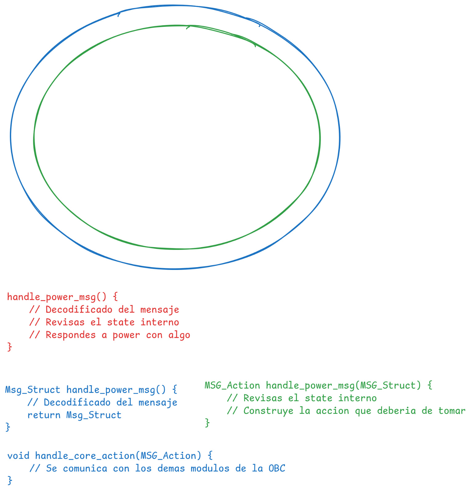

# POC

**IMPORTANT:** This project should be able to compile with a single `clang`
command.

## Problem

POC: Imprimir el logo del sistema operativo según la implementación. No usar
ninguna librería externa.

No se debe cambiar nada del código más que la configuración de compilación.

Solo los archivos dentro de impls/ son los que definen lógica que depende del
OS. Todo lo demás debe poder compartirse entre arquitecturas y OS distintos.
